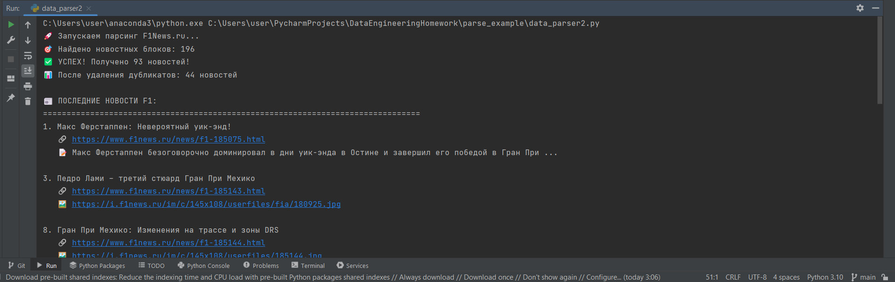

# F1 News Parser

Парсер для автоматического сбора новостей Formula 1 с официального российского новостного сайта F1News.ru.

## Описание проекта

Скрипт `data_parser.py` осуществляет парсинг главной страницы F1News.ru, извлекает актуальные новости и сохраняет их в структурированном виде в Pandas DataFrame. Проект демонстрирует навыки веб-скрапинга, обработки данных и работы с библиотеками для парсинга.

## Источник данных

**Целевой сайт**: https://www.f1news.ru/

## Технические требования

- Python 3.6+
- Библиотеки: 
  - `pandas` - для работы с данными в формате DataFrame
  - `requests` - для выполнения HTTP-запросов
  - `beautifulsoup4` - для парсинга HTML-контента

## Установка зависимостей

```bash
pip install pandas requests beautifulsoup4

## Демонстрация работы

